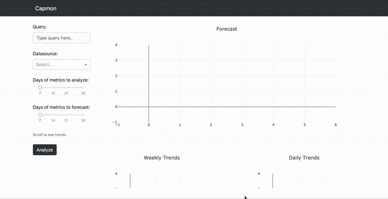

# Capmon

[](https://travis-ci.org/msk610/capmon)

Capmon is a stateless web-service to help you analyze long term trends
and generate forecasting for your metrics/data. You can use this to
determine things like traffic pattern and future growth pattern, which
you can utilize to determine how to proactively scale your services
for the future.



## Table of Contents
  * [Running Capmon](#running-capmon)
  * [Installing Dependencies](#installing-dependencies)
  * [Configuration](#configuration)
    + [Configuring datasources](#configuring-datasources)
  * [Forecasting and Analysis](#forecasting-and-analysis)
  * [Support](#support)

## Running Capmon
Capmon is a lightweight [Flask](https://flask.palletsprojects.com/)
application that uses [Dash](https://plotly.com/dash/) to render
interactive frontend that is 100% written in Python 3. To run the
application locally run the following command:

```sh
./run_server.sh
```

__NOTE__: please make sure to install dependencies

## Installing Dependencies
To install all of the dependencies for the service run the following
command:

```sh
./install_dependencies.sh
```

__NOTE__: make sure you have `pip` and `python3` setup

## Configuration
Capmon uses the following environment variables to configure
the webservice settings:

- `CAPMON_PORT`: port to run the service on
    * default: `8050`
- `CAPMON_WORKERS`: the number of workers to serve traffic
    * default: `2`
- `CAPMON_DEBUG`: whether to run the service on debug mode to see errors
    * default: `no` (yes to enable)
- `CAPMON_HOST`: host to bind the service to
    * default: `0.0.0.0`
- `CAPMON_CONFIG_PATH'`: path of file to load datasource configuration from
    * default: `$(PWD)/config.yml`

### Configuring datasources
Capmon requires you to provide a YAML based configuration file to configure
datasources to fetch data from. The following are the datasources that the
service currently supports:

- [Prometheus](https://prometheus.io/)
- [Graphite](https://graphiteapp.org/)

Please create an issue if you would like support for more types of datasources.

The configuration file should look like the following:
```yaml
---
datasources:
  - name: <name>
    source: '<url>'
    type: <type>
```

- `<name>`: is the name of the datasource to show on the Capmon UI.
- `<url>`: is the url to connect to datasource (i.e http://localhost:9090)
- `<type>`: is the type of the datasource (options are: `prometheus` and `graphite`)

__NOTE__: take a look at `config.yml` in the repository for example configuration

## Forecasting and Analysis
The service utilizes [fbprophet](https://facebook.github.io/prophet/) in order
to generate trend analysis and forecasting.

__NOTE__: initial instalation fbprophet can be computation intensive

Please create an issue if you would like support for more forecasting and
timeseries analysis libraries.

## Docker
There is a Dockerfile available for this service. It exposes port
`8050` for the service which you can port map.

## Support
If you would like support for additional functionalities please create an
open issue.
